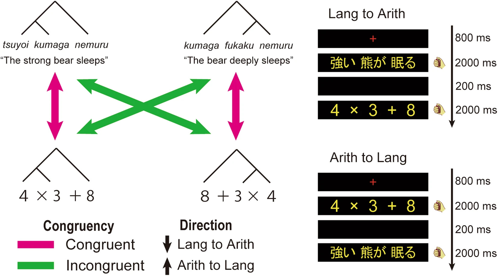

# nakai_demo
Repo of group project at CORE-1.

Group members: Zhiyi CHEN, Bihan WANG, Zhekun ZOU, Yixuan ZHU & Mengting JIANG

Reference: https://doi.org/10.1038/s41598-018-31279-8

## Divide labor: 
- Global settings of the experiment
- Trial structure
  - Below describes stimuli inside of a trial:
    1. A small red cross at the screen center, 800 ms;
    2. A A-expression/sentence, 2000 ms;
    3. Blank screen, 200 ms;
    4. A sentence/A-expression, 2000 ms;
    5. Inter-trial interval (ITI), 12000 - 15000 ms.
    

  

- Stimuli
  > For both A-expressions and sentences, we composed 16 left-branching (LB) and 16 right-branching (RB) stimuli. LB sentences were composed of an adjective, noun, and intransitive verb (e.g., Tsuyoi kumaga nemuru, the strong bear sleeps), whereas RB sentences were composed of a noun, adverb, and intransitive verb (e.g., Kumaga fukaku nemuru, the bear deeply sleeps). Semantically normal sentences contained a pair of combinable noun and verb. In contrast, semantically anomalous sentences contained a pair of incombinable noun and verb (e.g., Tsuyoi kumaga tsumoru, the strong bear accumulates). A-expressions were composed of three single digits and two operators (addition and multiplication), without any parentheses. LB A-expressions had multiplication embedded into the left part (e.g., 3 × 4 + 8), while RB A-expressions had multiplication embedded into the right part (e.g., 8 + 4 × 3). The calculation results of the standard A-expressions were always 20 or 30 (i.e., multiples of 10). Deviant A-expressions always had results of +1 or −1 to the standard expressions (e.g., 3 × 4 + 7).
  
  > All stimuli pairs were divided into two conditions (congruent and incongruent). In the congruent condition, LB was presented after LB, or RB was presented after RB. In the incongruent condition, LB was presented after RB, or RB was presented after LB. Half of the stimuli were semantically normal or standard stimuli, while the other half were anomalous or deviant. Standard and Deviant stimuli pairs were equally included in both congruent and incongruent pairs.
- Counterbalancing
- Data organization
- Presentation 

